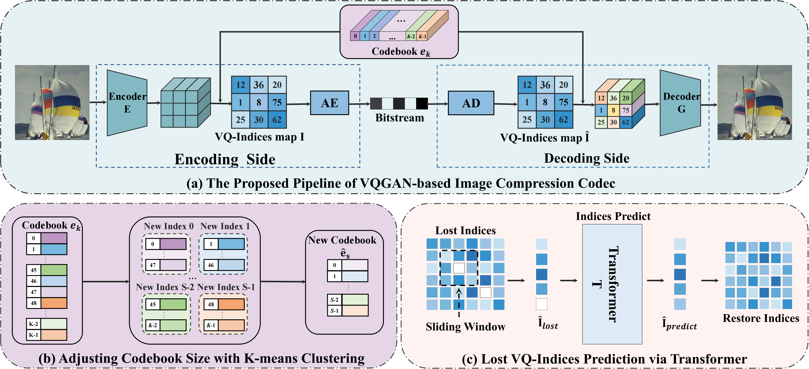
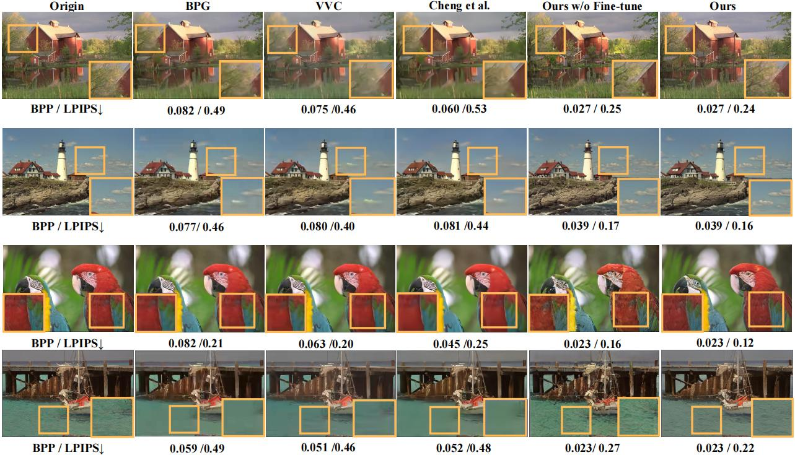

# Extreme Image Compression using Fine-tuned VQGAN Models
This repository is the official implementation of VQGAN-Comporession.

[Qi Mao](https://sites.google.com/view/qi-mao/), [Tinghan Yang](), [Yinuo Zhang](), [Zijian Wang](), [Meng Wang](https://scholar.google.com/citations?user=6vnhEIgAAAAJ&hl=zh-TW&oi=sra), [Shiqi Wang](), [Libiao Jin](), [Siwei Ma](https://scholar.google.com/citations?user=y3YqlaUAAAAJ&hl=zh-TW&oi=sra)

<p align="center">
  
<br>
<em> Figure:  Overview of the proposed VQGAN-based image coding framework.</em>
</p>

## Acknowledgement
The framework is based on [VQGAN](https://github.com/CompVis/taming-transformers). We modify taming.modules.vqgan and add train.py and reconstruction.py for usage.

## Introduction
In this work, we propose a simple yet effective coding framework by introducing vector quantization (VQ)--based generative models into the image compression domain.

[[Paper](https://arxiv.org/abs/2108.03690)] 

<p align="center">
  
<br>
<em> Figure: Our Results. </em> </p>

## Installation
Our method is tested using cuda11.3 on a single A100. The preparation work mainly includes configuring the environment.
```bash
conda env create -f environment.yaml
conda activate vqgan
```
### Reconstruction
If you want reconstruction imge with pretrained model, please download [Google driver](https://drive.google.com/drive/folders/14I_RnQ3cA6etdKGPVMFdmmVgMtBTB5rn?usp=sharing) from [Baidu cloud](https://pan.baidu.com/s/1zBeWKh6vgof13iTBwtA65A?pwd=kfl7) (code: kfl7) and put in `logs/`

Some evaluation dataset can be downloaded from 
[kodak dataset](http://r0k.us/graphics/kodak/) and [CLIC](http://challenge.compression.cc/tasks/) and put in `data/`
```bash
python reconstruction.py --logs_path $model_dir --dataset $dataset_name
```
An example: After evaluation on the Kodak dataset, fine tune the pre trained model of [vqgan_imagenet_f16_16384](https://heibox.uni-heidelberg.de/d/a7530b09fed84f80a887/) to a codebook size of 1024.
```bash
python reconstruction.py --logs_path logs/kmeans_tune/16384_kmeans_1024_epoch/epoch1/ --dataset Kodak/
```
The result is saved at `rec/Kodak/`

### Train
Prepare the dataset according to the instructions of the original [VQGAN](https://github.com/CompVis/taming-transformers?tab=readme-ov-file#data-preparation) project, but our training involves freezing the codec and only updating the codebook for fine-tuning. You can use the following code to achieve this:
```bash
python train.py --base configs/custom_vqgan.yaml -t True --gpus 0, --is_frozen
```
The fine-tune model is saved at `logs/`

## Citation
```
@inproceedings{wang2023extreme,
  title={Extreme Generative Human-Oriented Video Coding via Motion Representation Compression},
  author={Wang, Ruofan and Mao, Qi and Jia, Chuanmin and Wang, Ronggang and Ma, Siwei},
  booktitle={2023 IEEE International Symposium on Circuits and Systems (ISCAS)},
  pages={1--5},
  year={2023},
  organization={IEEE}
}
``` 

## Contact
Feel free to contact us if there is any question. (Qi Mao, qimao@cuc.edu.cn; Tinghan Yang, yangtinghan@cuc.edu.cn)