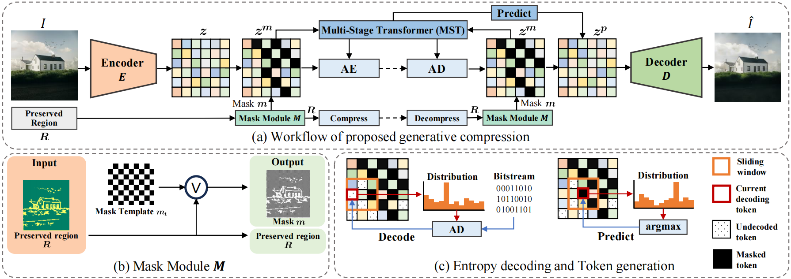
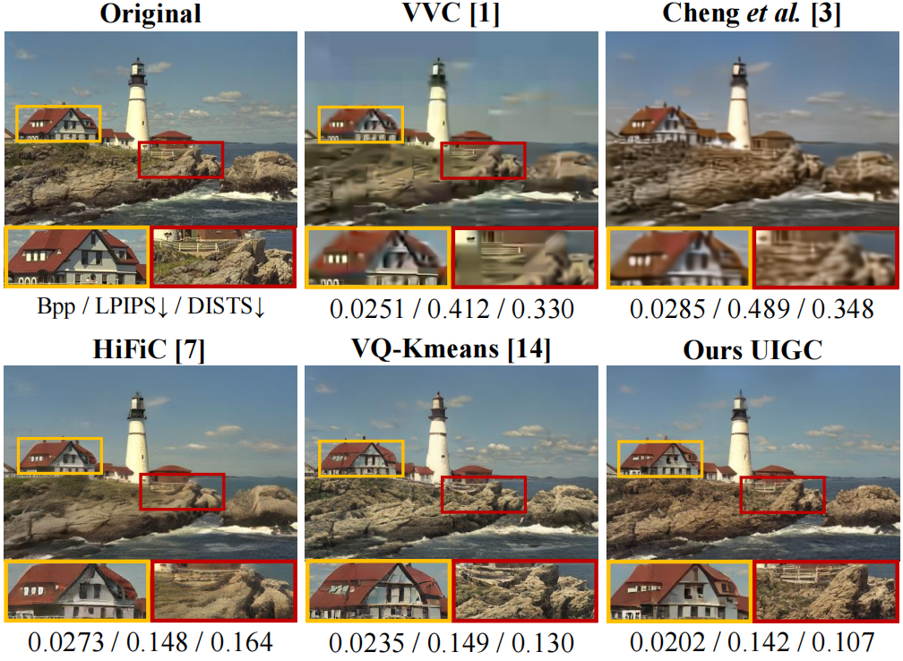
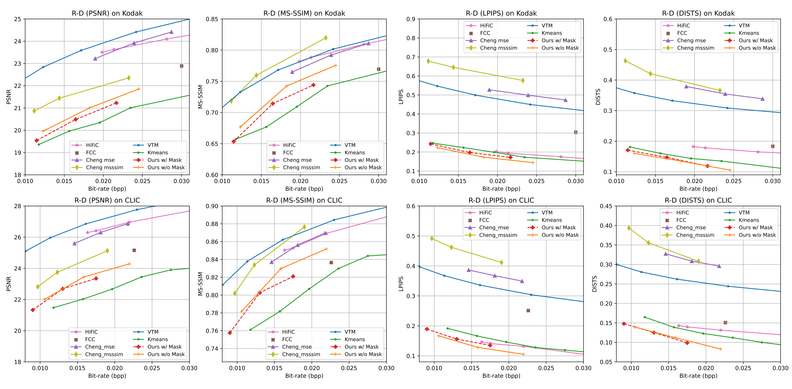

## Unifying Generation and Compression: Ultra-low bitrate Image Coding Via Multi-stage Transformer

> :confetti_ball:This is the official implementation of image compression based on UIGC.<br>
> :partying_face: This work is accepted by 2024 IEEE International Conference on Multimedia and Expo (ICME).
<p align="center">
    <br>
</p>

## :book: Table Of Contents
- [:eyes: Visual Visual Impressions](#visual_impression)
- [:crossed\_swords: Quantitative Performance](#quantitative_performance)
- [:zap: Inference](#inference)
- [:memo: TODO](#todo)
- [:heart: Acknowledgement](#acknowledgement)
- [:clipboard: Citation](#cite)

## <a name="visual_impression"></a>:eyes: Visual Impressions
<p align="center">
    <br>
</p>

## <a name="quantitative_performance"></a>:crossed_swords: Quantitative Performance
<p align="center">
    <br>
</p>

## :wrench: Install

```bash
conda env create -f environment.yml
conda activate UIGC
pip install bitstream==2.6.0.2
```

## <a name="inference"></a>:zap: Inference
1. Download fine-tuned VQGAN from [Google Driver](https://drive.google.com/drive/folders/14I_RnQ3cA6etdKGPVMFdmmVgMtBTB5rn?usp=sharing) or [Baidu Cloud](https://pan.baidu.com/s/1zBeWKh6vgof13iTBwtA65A?pwd=kfl7) (code: kfl7) into `./pretrained`.
 
2. Download the pre-trained transformer from [Baidu Cloud](https://pan.baidu.com/s/1iHQed7QqfuPJwlGOlF12kQ?pwd=7lqt) (code:7lqt).

3. Here we provide three modes of reconstruction:
* `entire` indicates the mode without any Mask applied,
* `edge_more` refers to the mode where a checkerboard Mask is generated based on the edge map,
* `minium` denotes the mode with a full checkerboard Mask.
* Run the following command. 

   ```
   python test.py --base configs/test/entire/Kodak/VQ16_Kodak.yaml --gpus 0,
   ```
   
## <a name="todo"></a>:memo: TODO
- [X] Release pretrained models.
- [X] Release inference code.
- [ ] Release training code.

## <a name="acknowledgement">:heart: Acknowledgement
This work is based on [VQGAN](https://github.com/lllyasviel/ControlNet), [miniGPT](https://github.com/karpathy/minGPT), thanks to their invaluable contributions.

## <a name="cite"></a>:clipboard: Citation

Please cite us if our work is useful for your research.

```
@inproceedings{xue2024unifying,
  title={Unifying Generation and Compression: Ultra-low bitrate Image Coding Via Multi-stage Transformer},
  author={Xue, Naifu and Mao, Qi and Wang, Zijian and Zhang, Yuan and Ma, Siwei},
  booktitle={2024 IEEE International Conference on Multimedia and Expo (ICME)}, 
  pages={1-6},
  year={2024}，
  organization={IEEE}
}
```